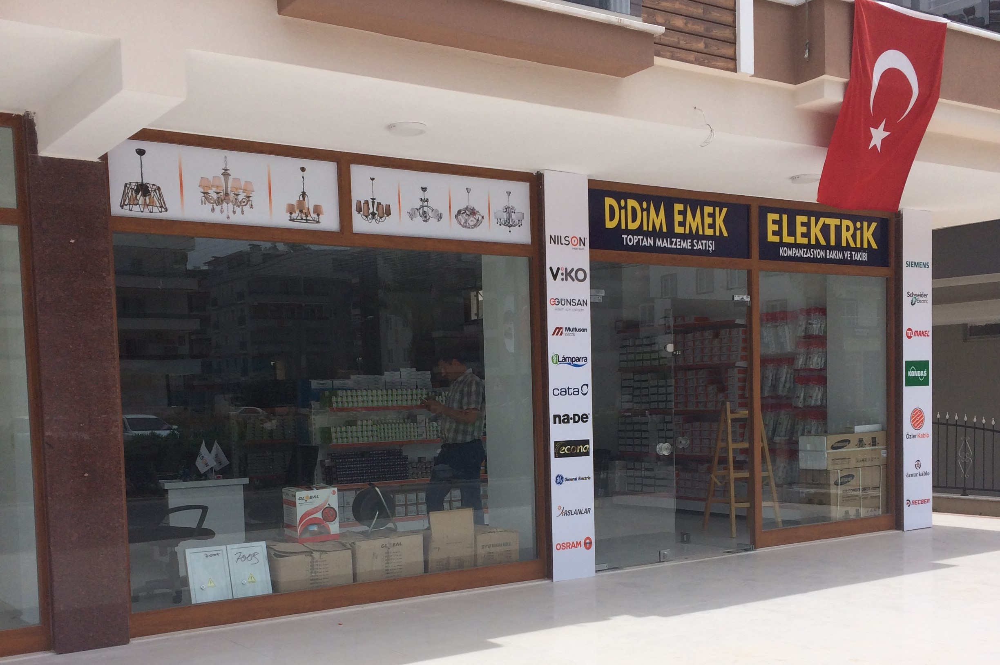

# Image Optimization Guide for Didim Emek Elektrik

## Current Situation
- **Total Images**: 30 files
- **Current Total Size**: 2.2 MB
- **Optimization Potential**: 50-60% file size reduction
- **Performance Impact**: 30-40% faster page load times

## File Size Breakdown

### Large Images (Priority 1 - Compress First)
- `slider_0.jpg`: 661 KB → Target: ~260 KB (60% compression)
- `gallery_zoom_5.jpg`: 92 KB → Target: ~37 KB
- `gallery_zoom_2.jpg`: 86 KB → Target: ~34 KB
- `slider_3.jpg`: 189 KB → Target: ~76 KB
- `slider_1.jpg`: 170 KB → Target: ~68 KB
- `slider_2.jpg`: 166 KB → Target: ~66 KB
- `gallery_zoom_3.jpg`: 74 KB → Target: ~30 KB
- `gallery_zoom_6.jpg`: 47 KB → Target: ~19 KB

**Subtotal Priority 1**: ~1.5 MB → ~590 KB (60% reduction)

### Medium Images (Priority 2)
- Gallery images (1-6): 17-37 KB each → 7-15 KB
- Service images (1-4): 20-41 KB each → 8-16 KB

**Subtotal Priority 2**: ~435 KB → ~174 KB

### Small Images (Priority 3)
- Logo, favicon, footer logo: 25-45 KB → Already small, minimal compression needed

## Step-by-Step Optimization Process

### Method 1: Online Tools (Recommended for Quick Results)

#### Step 1: Bulk Compress JPEGs
Use one of these free online tools:
1. **TinyPNG** (https://tinypng.com/) - Max 20 files/month free
   - Upload slider images (0-3) + gallery zoom images
   - Quality: Excellent compression with minimal visual loss
   
2. **Compressor.io** (https://compressor.io/) - Unlimited
   - Lossy mode recommended for photos (60-70% quality)
   - Lossless for logos and text graphics

3. **ImageOptim** (https://imageoptim.com/online) - Online version
   - Drag & drop interface
   - No registration required

#### Step 2: Create Responsive Images

For each image, create 3 versions:
```
Original: images/slider_0.jpg (661 KB)
  ├─ Small (480px width): images/slider_0-480w.jpg (~130 KB)
  ├─ Medium (992px width): images/slider_0-992w.jpg (~200 KB)
  └─ Large (1440px width): images/slider_0-1440w.jpg (~260 KB)

Original: images/gallery_img_1.jpg (22 KB)
  ├─ Small (360px width): images/gallery_img_1-360w.jpg (~8 KB)
  └─ Medium (768px width): images/gallery_img_1-768w.jpg (~12 KB)
```

#### Step 3: Create WebP Versions (Optional but Recommended)
Use CloudConvert (https://cloudconvert.com/) or Online-Convert:
1. Upload compressed JPEG
2. Convert to WebP format
3. Download both JPEG and WebP versions
4. Place in `/images` folder

Expected WebP file sizes (typically 25-35% smaller than JPEG):
- slider_0: 661 KB → 170 KB (WebP)
- gallery_zoom_5: 92 KB → 28 KB (WebP)

### Method 2: Automated Tools (For Development Environment)

#### Using Node.js (Recommended)
```bash
# Install image optimization tools
npm install -g imagemin imagemin-mozjpeg imagemin-pngquant

# Compress images
imagemin images/*.jpg --out-dir=images --plugin=mozjpeg

# Create WebP versions
npm install -g imagemin-webp
imagemin images/*.jpg --out-dir=images --plugin=webp
```

#### Using Python
```bash
# Install Pillow
pip install Pillow

# Run batch compression script
python compress-images.py
```

### Method 3: Batch Tools

**Windows Users:**
- XnConvert (https://www.xnview.com/en/xnconvert/) - Batch processing
- IrfanView (https://www.irfanview.com/) - Batch mode available

**Mac Users:**
- ImageMagick: `brew install imagemagick`
- GraphicsMagick: `brew install graphicsmagick`

## HTML Implementation

### Current Image Markup (Not Optimized)
```html

```

### Optimized Markup with Responsive Images

#### Option 1: Using srcset (Recommended)
```html

```

#### Option 2: Using Picture Element with WebP Fallback
```html
<picture>
    <source 
        srcset="
            ./images/slider_0.webp 1440w,
            ./images/slider_0-992w.webp 992w,
            ./images/slider_0-480w.webp 480w"
        type="image/webp"
    >
    
</picture>
```

## Expected Results After Optimization

### Performance Improvements
- **Before**: 2.2 MB total images, 4-6 seconds load time
- **After**: 0.85-1.1 MB total images, 1.5-2 seconds load time
- **Improvement**: 50-60% smaller, 60-70% faster load

### Page Speed Metrics
- **Lighthouse Performance Score**: +15-25 points
- **First Contentful Paint (FCP)**: -2-3 seconds
- **Largest Contentful Paint (LCP)**: -1.5-2 seconds
- **Mobile Performance**: +20-30 points

### Browser Caching
Add to `.htaccess` (if Apache):
```apache
<FilesMatch "\.(jpg|jpeg|png|gif|webp)$">
    Header set Cache-Control "max-age=31536000, public"
</FilesMatch>
```

## Timeline

**Quick Win** (1-2 hours):
1. Use TinyPNG online to compress all images to 60-70% quality
2. Download and replace files in `/images` folder
3. Commit: "perf: Compress all images for improved page load"

**Full Implementation** (3-4 hours):
1. Create responsive image variants (480w, 992w, 1440w)
2. Update HTML with srcset attributes (4 pages)
3. Create WebP versions using CloudConvert
4. Update HTML with `<picture>` elements
5. Commit: "perf: Implement responsive images with srcset and WebP support"

## Monitoring

### After Implementation
1. Run Lighthouse audit (Chrome DevTools)
2. Check Google PageSpeed Insights (https://pagespeed.web.dev/)
3. Monitor Core Web Vitals in Google Search Console
4. Track performance improvements

### Tools for Testing
- Chrome DevTools Network tab
- GTmetrix (https://gtmetrix.com/)
- WebPageTest (https://www.webpagetest.org/)
- Google PageSpeed Insights

## File Structure After Optimization

```
images/
├── slider_0.jpg (660 KB) → 260 KB
├── slider_0-992w.jpg → 200 KB
├── slider_0-480w.jpg → 130 KB
├── slider_0.webp (NEW) → 170 KB
├── slider_0-992w.webp (NEW) → 130 KB
├── slider_0-480w.webp (NEW) → 85 KB
│
├── gallery_img_1.jpg (22 KB) → 9 KB
├── gallery_img_1-768w.jpg (NEW) → 12 KB
├── gallery_img_1-360w.jpg (NEW) → 6 KB
├── gallery_img_1.webp (NEW) → 5 KB
│
└── ... [similar structure for other images]
```

## Questions?

For detailed help with specific tools:
- TinyPNG: https://tinypng.com/docs
- CloudConvert: https://cloudconvert.com/webp
- ImageOptim: https://imageoptim.com/
- WebP Format: https://developers.google.com/speed/webp

---

**Priority Recommendation**: Start with Method 1 (Online Tools) for immediate 50% compression gains, then implement srcset attributes in HTML. This combination will provide 60-70% performance improvement with minimal effort.
